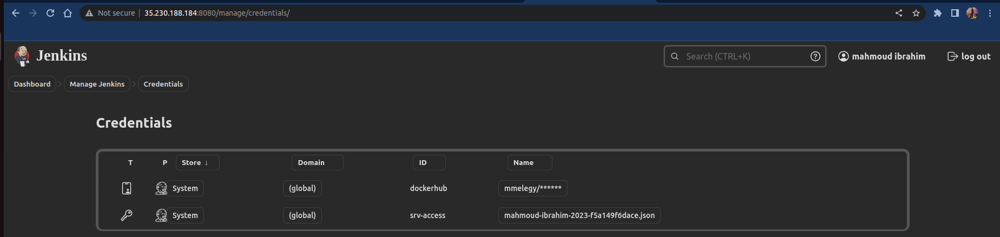
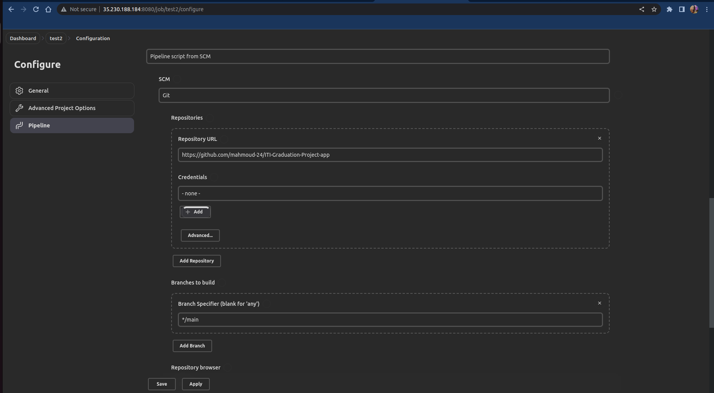
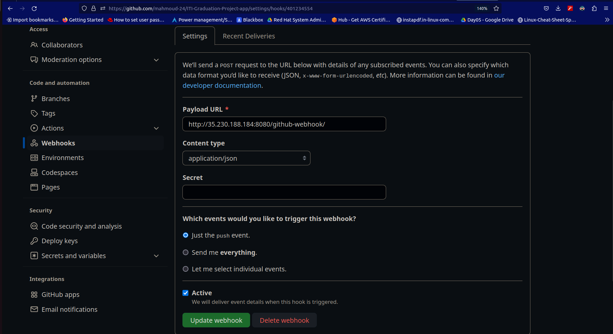
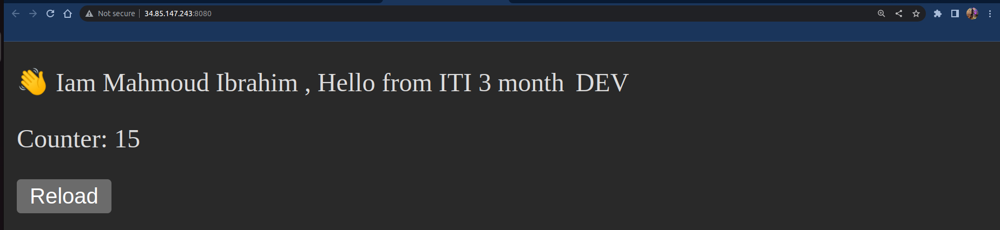

# ITI-Graduation-Project-app
## Deploy a backend appliciation on kubernetes cluster using CI/CD jenkins pipeline 

### Create Jenkins Credentials Configurations:
 - Create a username and password Credential for your Dockerhub account.
 - Create a SecretFile Credintial for the created cluster service account.


## create jenkins pipeline script

### CI stage: Building the image and Passing the Dockerhub credentials to login then Pushing the new image to Dockerhub
### CD stage: Activate Service Account then Connect to Cluster and Deploy the app with kubectl
```
pipeline {
    agent any

    stages {

        stage('CI'){
            steps {

                withCredentials([usernamePassword(credentialsId: 'dockerhub', usernameVariable: 'USERNAME', passwordVariable: 'PASSWORD')])            {

                sh """
                    cd backend-app
                    docker build . -t mmelegy/python-app:v$BUILD_NUMBER
                    docker login -u ${USERNAME} -p ${PASSWORD}
                    docker push mmelegy/python-app:v$BUILD_NUMBER
                    cd ..
                """
                }
              }
        }

        stage('CD'){
            steps {

                withCredentials([file(credentialsId: 'srv-access', variable: 'config')]){
                    sh """
                        gcloud auth activate-service-account --key-file=${config}
                        gcloud container clusters get-credentials private-cluster --zone us-east4-b --project mahmoud-ibrahim-2023
                        sed -i 's/tag/${BUILD_NUMBER}/g' deployment/deployment.yaml
                        kubectl apply -Rf deployment
                    """
                }
            }
 
        }
    }
}
```

### Create Dockerfile
- To dockerize the python app

### Create New Pipeline with the pipeline script


### Trigger CD pipeline to run automatically when push
- Activate the GitHub hook trigger from pipeline configuration
- Then Add Webhook


### Finally: we will hit the python-service IP to get The App 
